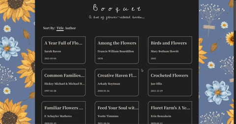

## Flower Books

A basic front-end application which demonstrates fetching and displaying data from an API.

# Demo & Snippets

<!--  -->

# Link

# Requirement/Purpose

Purpose of project is to demonstrate data fetching from an API and styling for a search engine webpage that displays books related to flowers.

Develop a basic front-end application with the following features:

- Fetch and display a list of books related to flowers from the following REST API: https://www.googleapis.com/books/v1/volumes?q=flowers - [x]
- Present the fetched data in a table, including book title, authors, and published date. - [x]
- Enable users to view more details of a selected book, such as title, subtitle, authors, image, and description. - [x]
- Encourage the candidates to showcase their creativity and add a personal touch to the application. - []
- Include a README file explaining the app's features and the creative elements introduced. - [x]

Stack used:

- React + Vite
- SCSS/SASS
- Typescript

Libraries:

- SASS
- react-query
- react-redux
- react-loader-spinner
- rtl
- react-overlays
- react-router-dom

# Build Steps

Prequisities:

- Vite
- Google Chrome
- VCS

Steps:

- Clone repo
- Navigate into client/ using CLI
- npm install
- npm run dev
- Open google chrome browser and copy link in command line(local: link) into browser searchbar.

# Design Goals/Approach

- For fetching all flower books, I have decided to use the react-query library. Although for the scope of this project we are fetching a specific API, I thought react-query would be best to use for its efficient fetching and error handling.
  - Will only use 40 flower-related books as google books API only allows 40 max at a time. To include filter feature, I am only using a specific query.
- Used Cedarville Cursive font purely for the title/header text. Book information will retain a generic font to improve UX in terms of reading.
- When user clicks on a cell/card, redirect user to new page which shows more information on book.
  - Image of book
  - description
  - Complete title and author text.
- Responsive design for phone, tablet and desktop.
- Favorite button that allows user to favorite a book.
  - At the center or right (on same level as sorting component), I will add a filter option 'all' and 'favourites' which will render favourited books or all books.
- For sort feature, I plan to use the .sort method to re-order the list by book title, author or date released. I will also have a reset option to bring list back to original order.

# Features

- Responsive design - []
- Can sort list by author, title or date published. -[]
- Can favorite books - []
- Can sort books by favourited - []

# Known Issues

# Future Goals

# Change Logs

# What did you struggle with?

# Licencing Details

# Further Details

https://fonts.google.com/specimen/Cedarville+Cursive
